## What is Dbcube?

Dbcube is more than just an ORM - it's a complete database ecosystem that includes:

- **ORM & Query Builder** - Fluent, type-safe database interactions
- **Rust Query Engine** - High-performance query execution
- **Schema Definition** - Visual `.cube` files for database schemas
- **CLI Tools** - Complete command-line interface for database operations
- **VS Code Extension** - Rich development experience with syntax highlighting
- **Multi-Database Support** - Works with MySQL, PostgreSQL, SQLite, and MongoDB

## Why Choose Dbcube?

### **Performance First**

Unlike traditional ORMs that can become performance bottlenecks, Dbcube uses a Rust-powered query engine for lightning-fast database operations while maintaining typescript's ease of use.

### **Developer Experience**

- **Type Safety**: Full TypeScript support with intelligent IntelliSense
- **Modern Syntax**: Clean, fluent API with async/await support
- **Visual Schemas**: Easy-to-read `.cube` files instead of complex migration scripts
- **Rich Tooling**: VS Code extension with syntax highlighting and validation

### **Universal Compatibility**

Write once, run anywhere. Dbcube's unified API works across multiple database engines without vendor lock-in.

### **Complete Ecosystem**

Everything you need for database development in one cohesive package - no need to mix and match different tools.

## How Dbcube Works

Dbcube uses a unique hybrid architecture:

```mermaid
%%{init: {'theme':'base','themeVariables':{'lineColor':'#22d3ee','fontFamily':'inherit','fontSize':'15px'}}}%%
flowchart LR
  A["Your code<br/><small>TypeScript</small>"]
  B["Type-safe<br/>Query Builder"]
  C["Rust core<br/><small>pooled connections</small>"]
  D[("Database")]

  A -->|"db.table('users').where('active','=',true).get()"| B
  B -->|"optimized plan"| C
  C -->|"native query"| D
  D -.->|"rows"| C
  C -.->|"decoded &amp; typed"| B
  B -.->|"plain JS objects"| A

  classDef app fill:#06141b,stroke:#22d3ee,stroke-width:2px,color:#e6fbff;
  classDef orm fill:#06141b,stroke:#a855f7,stroke-width:2px,color:#f3e8ff;
  classDef eng fill:#06141b,stroke:#3b82f6,stroke-width:2px,color:#dbeafe;
  classDef db  fill:#06141b,stroke:#22e3a0,stroke-width:2px,color:#d1fae5;
  class A app;
  class B orm;
  class C eng;
  class D db;
```



1. **TypeScript layer**: you write clean, modern, fully typed code.
2. **Query Builder**: Dbcube turns your fluent methods into an optimized plan.
3. **Rust core**: high-performance execution with connection pooling.
4. **Database layer**: native drivers for optimal database communication.

Results travel back the other way — decoded and typed — so you always get plain JavaScript objects.

## Core Concepts

### Tables and Models

Dbcube works with database tables through a fluent interface:

```typescript
// Get all active users
const users = await db.table("users").where("active", "=", true).get();

// Create a new user (insert always receives an array)
await db.table("users").insert([
  { name: "John Doe", email: "john@example.com" }
]);
```

### Schema Files

Define your database structure using readable `.cube` files:

::cube-code
---
filename: dbcube/users.table.cube
code: |
  @database("myapp");

  @meta({
    name: "users";
    description: "User accounts";
  });

  @columns({
    id: {
      type: "int";
      options: ["primary", "autoincrement"];
    };
    name: {
      type: "varchar";
      length: "255";
      options: ["not null"];
    };
    email: {
      type: "varchar";
      length: "255";
      options: ["not null", "unique"];
    };
  });
---
::

### CLI Operations

Manage your database with powerful CLI commands:

```bash
# Create a new database configuration
dbcube run database:create

# Run schema migrations
dbcube run table:fresh
dbcube run table:refresh

# Seed data
dbcube run seeder:add
```

## What's Next?

Now that you understand what Dbcube is and how it works, let's get it installed and set up your first project:

::card-grid

  ::card
  #title
  Quick Installation

  #default
  Get Dbcube installed and running in your project in minutes.  
  [Install Dbcube →](/getting-started/installation)
  ::

  ::card
  #title
  Project Setup

  #default
  Learn how to configure Dbcube and connect to your database.  
  [Project Setup →](/getting-started/configuration)
  ::

::


## Need Help?

::callout{type="info"}
**New to ORMs?** Don't worry! Dbcube is designed to be beginner-friendly while still powerful enough for complex applications. Our documentation includes plenty of examples and explanations.
::

If you run into any issues or have questions:

- Review the [Configuration guide](/getting-started/configuration) — most issues are connection-related
- Browse the [Query Builder reference](/guides/query-builder/database)
- Visit our [GitHub Repository](https://github.com/Dbcube/Dbcube) for issues and discussions
