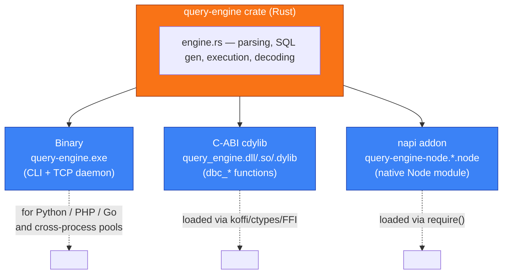
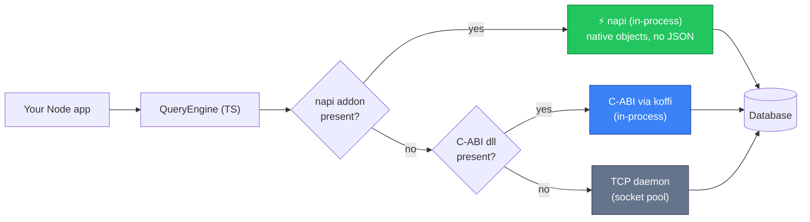
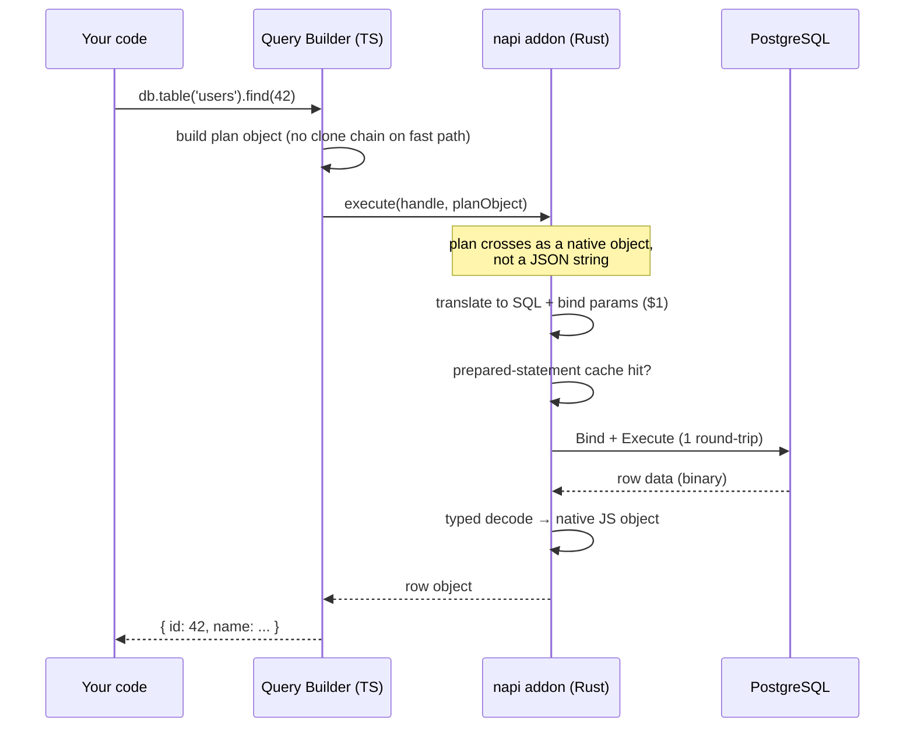
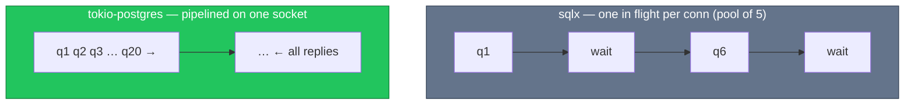
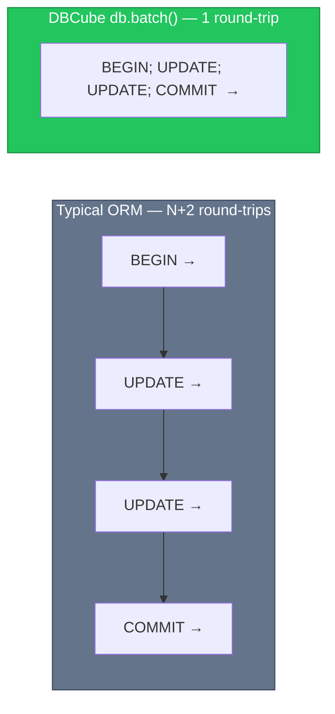

## One core, three deployment shapes

DBCube's query engine is a **single Rust crate** compiled into three artifacts
from the same source. Your application always talks to the same logical engine;
only the *transport* differs.

- **Binary** — a CLI for one-shot commands and a long-lived **TCP daemon** that
  shares warm connection pools across processes. Also the path other languages
  use when there's no native binding.
- **C-ABI cdylib** — exposes `dbc_connect`, `dbc_execute`, `dbc_raw`,
  `dbc_begin/commit/rollback`, `dbc_execute_batch`, … as a stable C interface
  for Python (ctypes/cffi), PHP (FFI), Go (cgo) and Node (koffi).
- **napi addon** — a native Node module with true `async` methods backed by
  Rust's tokio runtime, so calls return real Promises without blocking libuv.

::callout{type="info"}
This is why DBCube can be **multi-language** without rewriting the core: every
future client library (Python, PHP, Go) loads the same compiled engine.
::

## The embedded-backend cascade

In Node, the `EmbeddedEngine` picks the fastest available backend at startup and
falls back gracefully:

- **napi** (default when the `.node` file is present) runs the engine *inside*
  your process. Query plans and result rows cross the JS↔Rust boundary as
  **native objects** — no JSON serialization on the hot path.
- **koffi** loads the C-ABI library in-process when the napi addon isn't built
  for the platform.
- **TCP daemon** is the universal fallback (and the cross-process / cross-language
  option). Set `DBCUBE_EMBEDDED=0` to force it.

## How a query flows (napi, the fast path)

## PostgreSQL: pipelining + prepared-statement cache

The PostgreSQL path uses **tokio-postgres** (MySQL and SQLite use `sqlx`,
MongoDB uses its native driver). Two properties make it fast under load:

### 1. Pipelining shared connections

`sqlx` runs **one query in flight per connection** — 100 concurrent lookups
with a pool of N drain in ~100/N waves, each wave a network round-trip.
tokio-postgres lets DBCube put **many queries in flight on the same socket**:

DBCube keeps a small set of **shared, pipelining clients** for autocommit
queries (round-robin), so 100 parallel `find()` calls resolve in roughly one
round-trip instead of one-at-a-time. This is what turned the concurrency
benchmark from **3.5× behind Prisma into a tie**.

### 2. Per-connection prepared-statement cache

Identical SQL (`WHERE "id" = $1`) is prepared **once per connection** and then
reused with just **Bind + Execute** — no repeated PARSE/DESCRIBE. The cache is
what keeps single-query latency at one round-trip while still pipelining.

::callout{type="info"}
Parameters are always **bound** (`$1`, `$2`, …), never interpolated. This
defeats SQL injection *and* maximizes prepared-statement reuse. Float-vs-int
type stability on a shared placeholder is handled with an explicit
`::double precision` cast so a cached statement never coerces a value to the
wrong type.
::

## Transactions in a single round-trip

A transaction usually costs `BEGIN` + N statements + `COMMIT` = **N+2 network
round-trips**. DBCube collapses the common case (a sequence of writes) into
**one**:

- `db.transaction(cb)` — interactive: you run reads and writes against a `trx`
  connection; any thrown error rolls everything back automatically. Held on a
  **dedicated** connection from a separate transaction pool (isolation).
- `db.batch(cb)` — the optimized form: a pure sequence of writes is shipped as a
  single `BEGIN; …; COMMIT;` script. For PostgreSQL and SQLite this is **one
  round-trip**; MySQL and MongoDB use a classic transaction (still one
  JS↔engine crossing).

## Typed row decoding

Rather than guessing types per cell with a chain of fallible casts, the engine
dispatches on the column's declared type (`int4`, `float8`, `numeric`, `uuid`,
`jsonb`, `timestamptz`, …) and decodes directly to the right JSON value. This
removes a large class of wasted work on every row of every result set.

## Connection budget & configuration

All pool sizes are configurable from `dbcube.config.js` (see
[Configuration](/getting-started/configuration)):

| Knob | Default (Postgres/MySQL) | Default (SQLite) |
|---|---|---|
| `pool.max` | 5 shared + 5 tx | 10 |
| `pool.min` | 2 | 1 |
| `pool.acquireTimeoutMs` | 3000 | 3000 |
| `daemon.*` | TCP fallback tuning | — |

::callout{type="success"}
Next: see the **[Examples](/examples/overview)** for runnable code covering every
feature, or the **[Query Builder guides](/guides/query-builder/database)** for
the full API.
::
