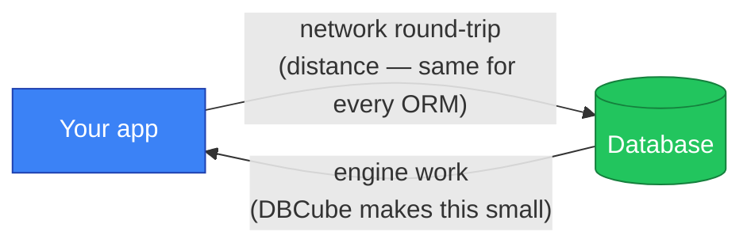

## The one thing to understand

Every database query is made of **two costs**:

```
total time  =  network round-trip   +   engine work
               (app ↔ database)          (parse · plan · execute · decode)
```

DBCube makes the **engine work** part as small as possible — that's where it
beats other ORMs. But it cannot change the **network** part: that's physics
(distance and the speed of light).



::callout{type="info"}
**The closer your app is to your database, the more DBCube's speed shows.**
When the network is small, the engine dominates — and DBCube wins. When the
network is large, it dominates everything and every ORM looks the same.
::

## Two scenarios, two outcomes

### Same region (production) — DBCube wins

In real production your app and database live in the **same region/datacenter**,
so the network round-trip is well under ~1 ms. The engine is now the deciding
factor, and DBCube is fastest — see the [benchmarks](/performance/benchmarks)
(PostgreSQL 16, same machine):

| Operation | DBCube | Prisma |
|---|---:|---:|
| SELECT by primary key | **0.73 ms** | 1.01 ms |
| UPDATE by primary key | **1.41 ms** | 1.82 ms |
| Transaction (2 writes) | **2.07 ms** | 3.82 ms |

This is the scenario that matters for your users.

### Remote database (your laptop → cloud) — the network wins

If you query a cloud database **from your laptop**, every request crosses the
public internet — often 150–200 ms round-trip. That single number dwarfs the
engine. DBCube and other ORMs end up **tied**, because both are just waiting on
the network:

| Same query, remote cloud DB | DBCube | Prisma |
|---|---:|---:|
| SELECT (warm connection) | ~185 ms | ~180 ms |

Nothing is wrong here — you're measuring your Wi-Fi and the distance to the
datacenter, not the database engine. **No ORM can be faster than the network.**

## Measuring fairly

If you compare DBCube against another ORM, make the test honest — otherwise the
result means nothing:

1. **Same database, same endpoint.** Point both tools at the *exact* same host.
   Managed providers expose several endpoints (a direct one and a pooled one);
   mixing them silently skews the result.
2. **Same connection budget.** Give both a warm, single connection (or the same
   pool size). See [`pool` configuration](/getting-started/configuration#connection-pool):
   ```javascript
   pool: { maxConnections: 1, minConnections: 1 }
   ```
3. **Warm up first.** The first query of any tool pays a one-time connection +
   handshake cost. Discard warmup runs; measure steady state.
4. **Run several iterations.** Report the **median** (and p95), not a single
   sample — one network hiccup shouldn't decide the comparison.

::callout{type="success"}
Do this and you'll see the truth: **tied on a remote database** (network-bound),
**DBCube ahead when the database is close** (engine-bound) — which is exactly
where it counts in production.
::

## TL;DR

- DBCube optimizes the part it can control — the **engine** — and is the fastest
  of the major Node ORMs there.
- On a **remote** database the **network** dominates and everything ties; that's
  physics, not the ORM.
- Keep your app and database **in the same region** to feel the difference.
- When benchmarking, use the **same endpoint, same connection budget, warm,
  median of several runs**.
