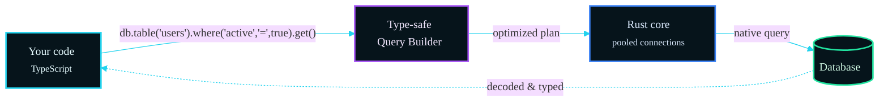
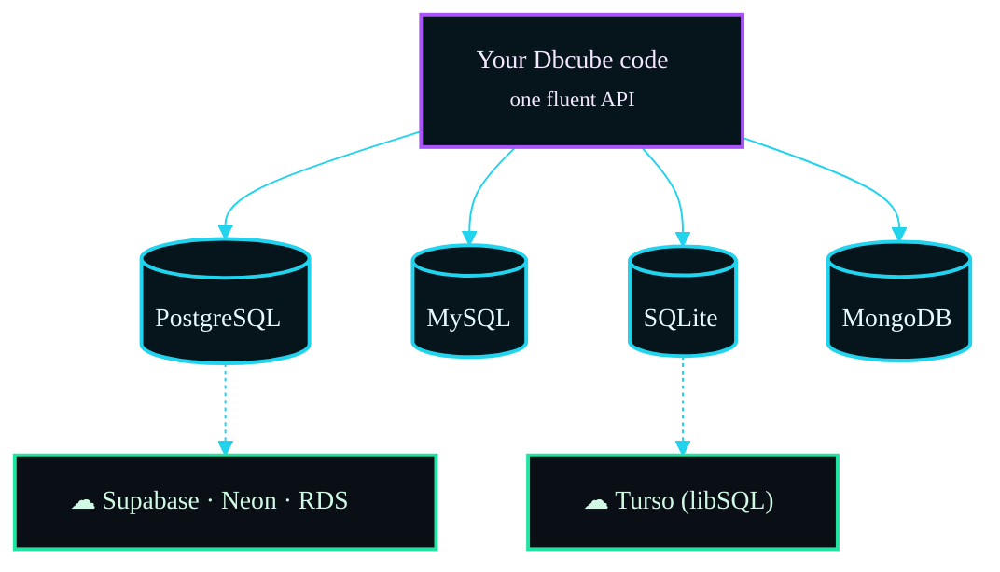

Today we're launching **Dbcube** — a type-safe, Rust-powered ORM for Node.js that
speaks **PostgreSQL, MySQL, SQLite and MongoDB** through a single, fluent API, and
connects to managed hosts like **Supabase and Turso**. One codebase, every
database, native-engine speed.

This post covers three things: **why it's fast** (with reproducible benchmarks),
**what the code looks like**, and **how the same app runs on Supabase, Turso and
the rest** without changes.

## Why we built it

Every ORM in Node runs query building, SQL generation and row decoding **in the
JavaScript event loop**, through a driver. That's fine until it isn't — under
load, that per-query overhead is exactly what serializes your throughput.

Dbcube moves that work into a **native engine**. The JavaScript side only
*describes* the query; a compiled engine executes it and hands back plain
objects. You write idiomatic TypeScript; the heavy lifting happens off the event
loop.



## The benchmarks (run them yourself)

We don't ask you to trust a marketing number. The
[benchmark suite](/performance/benchmarks) is reproducible in five commands,
runs against a **real PostgreSQL 16**, and pits Dbcube against **Prisma,
Drizzle, TypeORM and Knex** with identical schema, data, machine and connection
budget.

Median latency in milliseconds, lower is better. **Bold** = fastest of all five.

| Operation | Dbcube | Prisma | Drizzle | TypeORM | Knex |
|---|---:|---:|---:|---:|---:|
| SELECT by primary key | **1.15** | 1.85 | 1.27 | 1.24 | 1.25 |
| Filtered list (WHERE+ORDER+LIMIT) | **1.10** | 1.53 | 1.17 | 1.16 | 1.31 |
| COUNT with filter | **0.83** | 1.09 | 1.01 | 1.04 | 1.12 |
| Transaction (2 atomic updates) | **2.15** | 4.70 | 4.07 | 5.58 | 4.55 |
| 100 concurrent lookups (per round) | **8.29** | 9.35 | 24.11 | 22.97 | 18.18 |

Where Dbcube leads: **reads, transactions and concurrency** — the bulk of what
real apps do. It **beats Prisma on every operation** in the run.

And the honest part: **Dbcube is not #1 at everything.** For a tight loop of raw
`INSERT`s, **Knex** — which sits right on top of the driver with no plan layer —
is faster on bulk insert. We publish that too, because a benchmark you can't
trust is worthless. [See the full table and methodology →](/performance/benchmarks)

::callout{type="info"}
Numbers move with hardware. That's the point of shipping the suite — run it on
yours and check.
::

## The syntax

One fluent, chainable, fully typed API. Generate interfaces from your schema with
`npx dbcube generate`, and every query is checked at compile time.

### Reads

```ts
import { dbcube } from "dbcube";
import type { User } from "./dbcube/types";

const db = dbcube.database("app");

const active = await db.table<User>("users")
  .where("status", "=", "active")
  .where("age", ">", 30)
  .orderBy("age", "DESC")
  .limit(20)
  .get();                       // → User[]

const user = await db.table<User>("users").find(42);   // by primary key
```

### Writes

```ts
// insert returns the rows with their generated ids
const [created] = await db.table<User>("users").insert([
  { name: "Ada Lovelace", email: "ada@example.com", age: 36 },
]);

// update & delete REQUIRE a where() — no accidental mass writes
await db.table<User>("users").where("id", "=", created.id).update({ status: "vip" });

// atomic counters, no read-modify-write race
await db.table<User>("users").where("id", "=", 1).increment("balance", 250);
```

### Transactions in one round-trip

`db.batch()` ships begin + every write + commit as a **single network
round-trip** — the structural reason transactions come out ~2× faster.

```ts
await db.batch((b) => {
  b.table("accounts").where("id", "=", 1).decrement("balance", 200);
  b.table("accounts").where("id", "=", 2).increment("balance", 200);
});
```

### Relations without N+1

```ts
const users = await db.table<User>("users")
  .with("orders", { table: "orders", foreignKey: "user_id", type: "many" })
  .get();   // one batched query per relation, not one per row
```

## One API, every database

The same builder runs on four engines. You change a **config entry**, not your
code — and those engines also reach managed hosts like Supabase and Turso.



That includes document databases: the exact same `where().orderBy().get()` chain
works on **MongoDB**, translated to the native query language under the hood.

## Works with your cloud — Supabase, Turso & friends

Dbcube connects to managed databases over TLS with one connection string. No
special adapter, no code change — just point a config entry at the host.

### Supabase / Neon / RDS (PostgreSQL)

```ts
// dbcube.config.js
module.exports = (config) => config.set({
  databases: {
    app: {
      type: "postgres",
      config: {
        URL: process.env.DATABASE_URL,  // postgresql://...@db.<ref>.supabase.co:5432/postgres
        // TLS is on by default for managed hosts
      },
    },
  },
});
```

### Turso (libSQL / SQLite at the edge)

```ts
module.exports = (config) => config.set({
  databases: {
    edge: {
      type: "sqlite",
      config: {
        URL: process.env.TURSO_URL,          // libsql://<db>-<org>.turso.io
        AUTH_TOKEN: process.env.TURSO_TOKEN,
      },
    },
  },
});
```

Your queries don't change between local SQLite, a Supabase Postgres and a Turso
edge database. Develop on a local file, ship to the cloud, swap the config —
that's the whole migration.

::callout{type="success"}
The same is true for **PlanetScale** (MySQL) and **MongoDB Atlas** — managed
host, TLS on, one connection string. See [Configuration →](/getting-started/configuration#cloud-databases-url--tls).
::

## Beyond speed

Raw latency is half the story. Dbcube also ships the things a real project needs:

- **`.cube` schema files** — declarative tables, seeders and triggers in clean,
  reviewable files, with auto-generated migrations *and rollback*.
- **Generated TypeScript types** — `npx dbcube generate` keeps your types in
  lock-step with the schema.
- **Computed fields & runtime triggers** — virtual columns and before/after
  hooks, built in.
- **A real CLI** — migrations, introspection, type generation, a health doctor
  and watch mode.

## Get started

```bash
npm install dbcube
```

The native Rust engine binary is fetched automatically for your platform on
install — no toolchain required.

Then read the [5-minute quickstart](/getting-started/introduction), browse the
[real-world examples](/examples/overview) (a blog API, a checkout, auth,
analytics — all in TypeScript), or jump straight to the
[benchmarks](/performance/benchmarks) and run them yourself.

Welcome to Dbcube. Write once, run anywhere — at Rust speed.

---

> ⚖️ **A note on the engine:** the native engine binary is proprietary (not
> MIT-licensed). Decompiling, decompressing or otherwise reverse-engineering it
> to extract its source code or internals is **prohibited and illegal** and
> infringes Dbcube's intellectual property rights. Use it through the public API.
