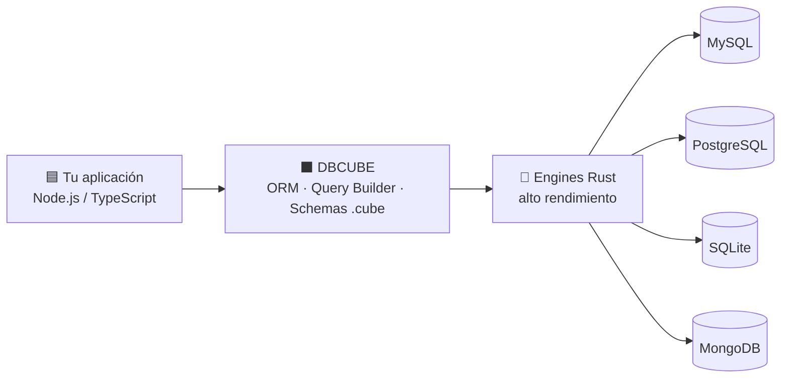
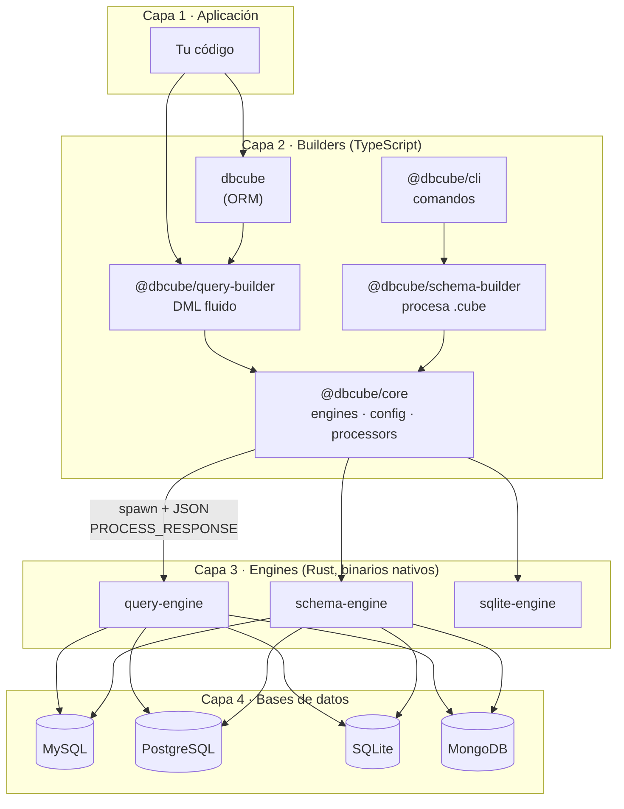
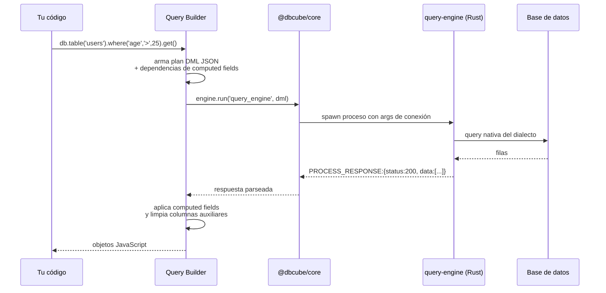
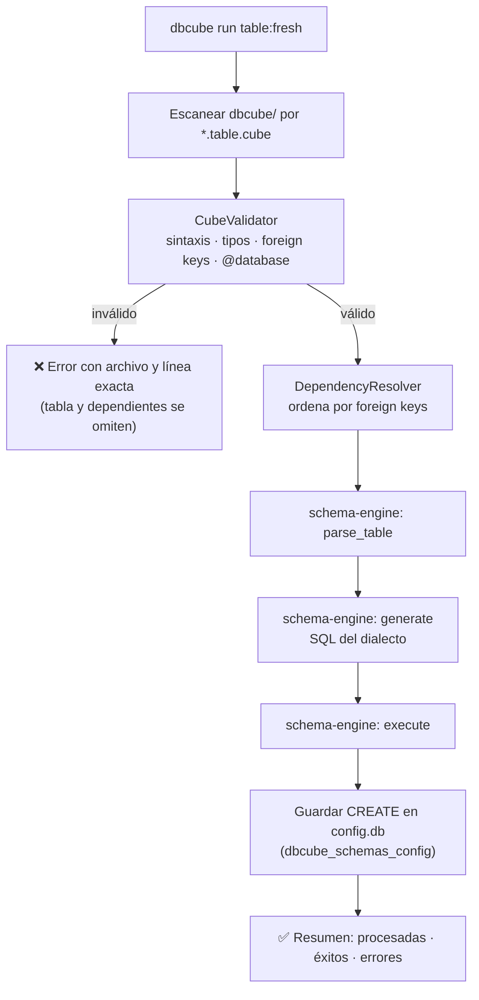
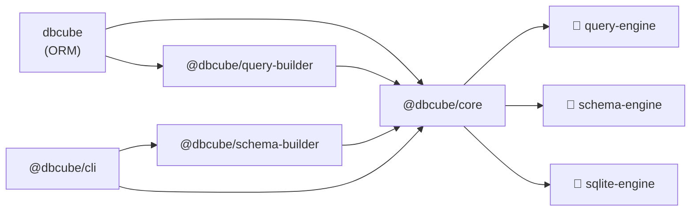
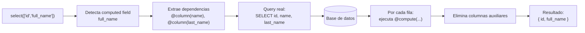
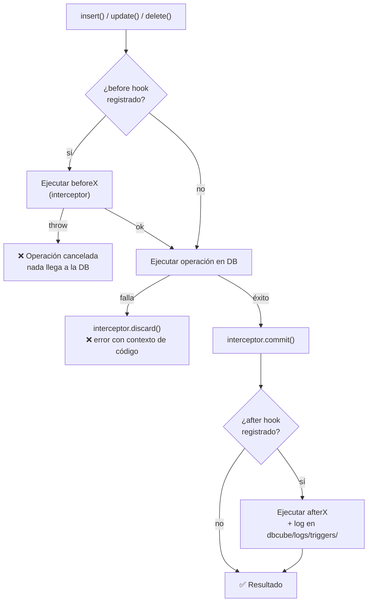
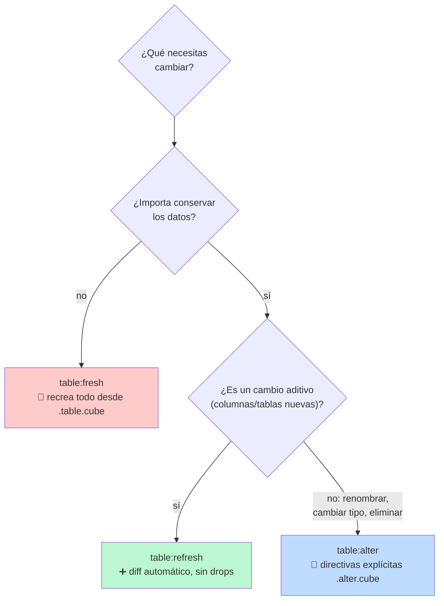
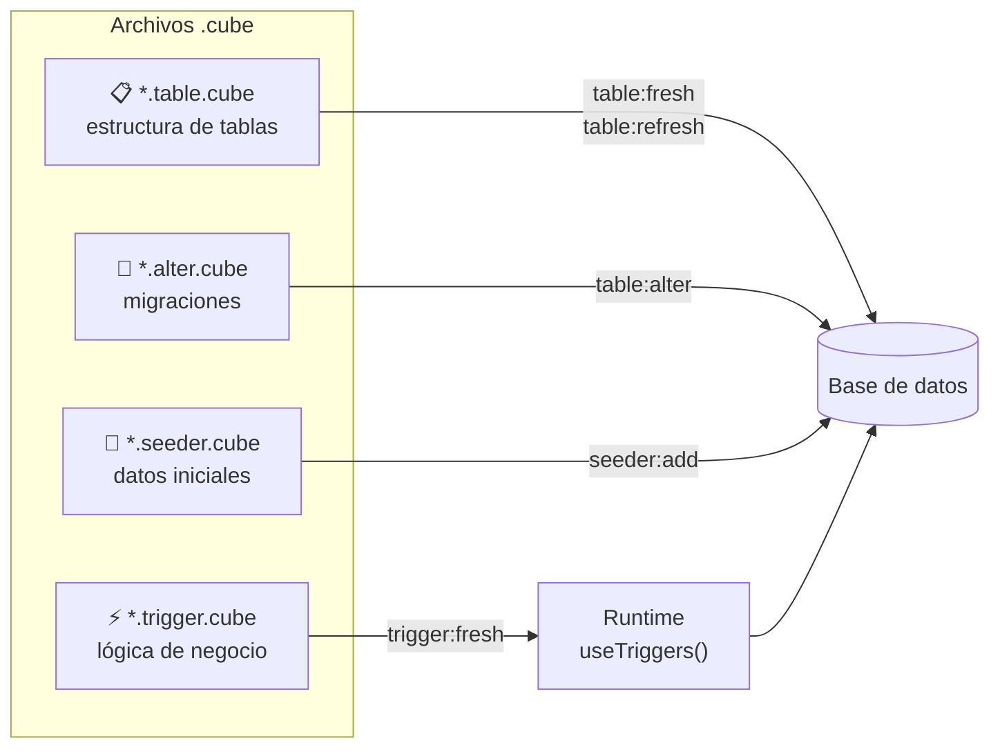
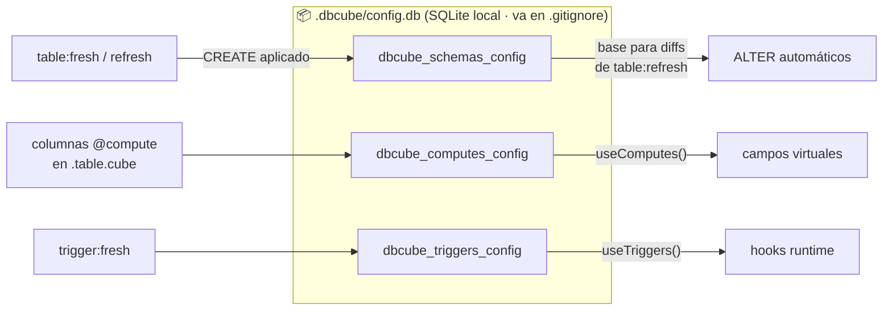

# 📐 Diagramas para el sitio de DBCube

> Cada diagrama tiene: **ID**, **ubicación exacta** (archivo + marcador), **propósito**, y el **código Mermaid** como referencia para reproducirlo en tu sistema de diagramas.
>
> En las páginas nuevas dejé marcadores HTML del tipo `<!-- DIAGRAM: id -->` — busca el ID y reemplaza el comentario por la imagen.
>
> **Convención de archivos sugerida:** exportar a `my-docs/public/diagrams/<id>.svg` y embeber con:
> ```md
> 
> ```
>
> **Paleta sugerida** (coherente con el sitio): fondo transparente, azul `#3B82F6` para capas JS/TS, naranja `#F97316` para Rust, verde `#22C55E` para bases de datos, gris `#64748B` para flechas/texto secundario.

---

## 1. `ecosystem-hero` — Diagrama hero del ecosistema

- **Ubicación:** `content/index.md`, dentro de la sección `#features` (id `features`), idealmente arriba del grid de features o como imagen del hero.
- **Propósito:** que en 5 segundos se entienda qué es DBCube: una capa unificada entre tu app y 4 bases de datos, potenciada por Rust.
- **Estilo:** horizontal, limpio, pocos elementos, logos de las 4 DBs si es posible.



---

## 2. `architecture-overview` — Arquitectura por capas

- **Ubicación:** `content/1.getting-started/4.architecture.md` → marcador `<!-- DIAGRAM: architecture-overview -->` (justo después de la introducción, antes de "## The Layers").
- **Propósito:** mostrar las 4 capas completas con todos los paquetes y su responsabilidad.
- **Estilo:** vertical (de arriba: app → abajo: bases de datos), agrupando por capa con contenedores.



---

## 3. `query-flow` — Flujo de una consulta

- **Ubicación:** `content/1.getting-started/4.architecture.md` → marcador `<!-- DIAGRAM: query-flow -->` (sección "## How a Query Flows").
- **Propósito:** secuencia paso a paso de `db.table('users').where(...).get()`.
- **Estilo:** diagrama de secuencia.



---

## 4. `schema-flow` — Flujo de una migración de schema

- **Ubicación:** `content/1.getting-started/4.architecture.md` → marcador `<!-- DIAGRAM: schema-flow -->` (sección "## How a Schema Migration Flows").
- **Propósito:** qué pasa al ejecutar `dbcube run table:fresh`.
- **Estilo:** flujo vertical con decisión de validación.



---

## 5. `package-dependencies` — Mapa de paquetes

- **Ubicación:** `content/1.getting-started/4.architecture.md` → marcador `<!-- DIAGRAM: package-dependencies -->` (sección "## Package Map"; puede reemplazar al árbol ASCII).
- **Propósito:** dependencias reales entre paquetes npm y binarios.



---

## 6. `computed-fields-flow` — Cómo se resuelve un computed field

- **Ubicación:** `content/2.guides/query-builder/8.computed-fields.md` → marcador `<!-- DIAGRAM: computed-fields-flow -->` (tras la introducción).
- **Propósito:** visualizar la magia: pides `full_name`, DBCube trae `name` + `last_name`, ejecuta tu función y te devuelve solo lo pedido.



---

## 7. `trigger-lifecycle` — Ciclo de vida de los triggers

- **Ubicación:** `content/2.guides/query-builder/9.runtime-triggers.md` → marcador `<!-- DIAGRAM: trigger-lifecycle -->` (tras la introducción).
- **Propósito:** mostrar el sandwich before → operación → after, con las rutas de error (throw en before = no se escribe; fallo en DB = discard).



---

## 8. `migration-strategies` — Las 3 estrategias de migración

- **Ubicación:** `content/2.guides/schemas/7.alter-tables.md` → marcador `<!-- DIAGRAM: migration-strategies -->` (tras la introducción, complementa la tabla "When to Use Which").
- **Propósito:** árbol de decisión: ¿qué comando uso?



---

## 9. `cube-file-types` — Los 4 tipos de archivo .cube

- **Ubicación:** `content/2.guides/schemas/1.overview.md`, al inicio de la sección "## Types of .cube Files" (no dejé marcador; insertarlo justo bajo ese título).
- **Propósito:** mapa mental de los 4 tipos y qué comando CLI consume cada uno.



---

## 10. `config-db-state` — Estado local (.dbcube/config.db)

- **Ubicación:** `content/1.getting-started/4.architecture.md`, sección "## Local State: the `config.db`" (no dejé marcador; insertarlo bajo el título, antes de la tabla).
- **Propósito:** aclarar qué se guarda localmente y qué comando alimenta cada tabla.



---

## Resumen de inserción

| # | ID | Archivo destino | Marcador existente |
|---|----|-----------------|--------------------|
| 1 | `ecosystem-hero` | `content/index.md` | No (insertar en hero/features) |
| 2 | `architecture-overview` | `content/1.getting-started/4.architecture.md` | ✅ `<!-- DIAGRAM: architecture-overview -->` |
| 3 | `query-flow` | `content/1.getting-started/4.architecture.md` | ✅ `<!-- DIAGRAM: query-flow -->` |
| 4 | `schema-flow` | `content/1.getting-started/4.architecture.md` | ✅ `<!-- DIAGRAM: schema-flow -->` |
| 5 | `package-dependencies` | `content/1.getting-started/4.architecture.md` | ✅ `<!-- DIAGRAM: package-dependencies -->` |
| 6 | `computed-fields-flow` | `content/2.guides/query-builder/8.computed-fields.md` | ✅ `<!-- DIAGRAM: computed-fields-flow -->` |
| 7 | `trigger-lifecycle` | `content/2.guides/query-builder/9.runtime-triggers.md` | ✅ `<!-- DIAGRAM: trigger-lifecycle -->` |
| 8 | `migration-strategies` | `content/2.guides/schemas/7.alter-tables.md` | ✅ `<!-- DIAGRAM: migration-strategies -->` |
| 9 | `cube-file-types` | `content/2.guides/schemas/1.overview.md` | No (insertar bajo "Types of .cube Files") |
| 10 | `config-db-state` | `content/1.getting-started/4.architecture.md` | No (insertar bajo "Local State") |

Cuando tengas un diagrama exportado, avísame y lo integro en la página con el componente de imagen del sitio.
